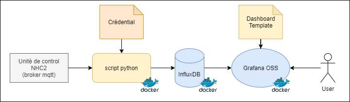

# NHC2 To Grafana

This project sends all information from control unit 2 by Niko Home Control to Influxdb, and it's read by Grafana.

To have a Niko Home Control 2 JWT token. This token must be updated every year. https://guide.niko.eu/display/SMNHCLV/Hobby+API



## Quick start
```
$ nano .nhc2influx.env
```
```
NHC2_HOST="FP<MAC-Address>"
NHC2_PASS="<JWT>"
INFLUX_URL=http:/<host>:8086
INFLUX_TOKEN=""
INFLUX_ORG=""
INFLUX_BUCKET=""
```
```
$ docker run --env-file .nhc2influx.env armentech/nhc2influxdb:latest
```


## Install
**Requirements**
- influxdb 1.8 or influxdb 2
- grafana OSS

## Setup
- Define environmental variables in docker-compose
- Start docker-compose


## Developper

```
$ python3 -m venv env
$ source env/bin/activate
$ pip install --no-cache-dir -r requirements.txt
```